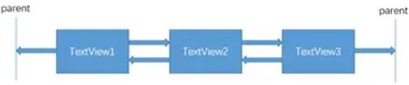
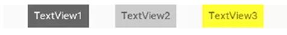
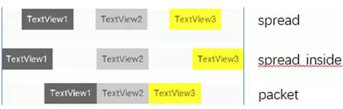
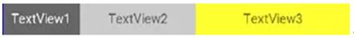
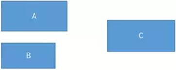
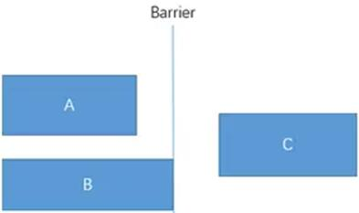

## 简介
约束布局ConstraintLayout 是一个ViewGroup，可以在Api9以上的Android系统使用它，它的出现主要是为了解决布局嵌套过多的问题，以灵活的方式定位和调整小部件。

使用约束布局需要在app/build.gradle文件中添加ConstraintLayout的依赖，默认情况下AS已经帮我们依赖了：
```
implementation 'com.android.support.constraint:constraint-layout:1.1.3'
```

## 一般约束
|属性 | 作用|
|:- | :-|
|layout_constraintLeft_toLeftOf	| 当前View的左边与目标View的左边对齐|
|layout_constraintLeft_toRightOf | 当前View的左边与目标View的右边对齐|
|layout_constraintRight_toLeftOf |当前View的右边与目标View的左边对齐|
|layout_constraintRight_toRightOf | 当前View的右边与目标View的右边对齐|
|layout_constraintTop_toTopOf | 当前View的上边与目标View的上边对齐|
|layout_constraintTop_toBottomOf | 当前View的上边与目标View的下边对齐|
|layout_constraintBottom_toTopOf | 当前View的下边与目标View的上边对齐|
|layout_constraintBottom_toBottomOf | 当前View的下边车目标View的下边对齐|
|layout_constraintBaseline_toBaselineOf | 当前View的Baseline与目标View的Baseline对齐|
|layout_constraintStart_toEndOf | 当前View的左边与目标View的右边对齐|
|layout_constraintStart_toStartOf | 当前View的左边与目标View的左边对齐|
|layout_constraintEnd_toStartOf | 当前View的右边与目标View的左边对齐|
|layout_constraintEnd_toEndOf | 当前View的右边与目标View的右边对齐|

使用定位属性居中显示：
```
<android.support.constraint.ConstraintLayout
    android:layout_width="match_parent"
    android:layout_height="match_parent">
    <TextView
        android:layout_width="wrap_content"
        android:layout_height="wrap_content"
        android:text="hello"
        app:layout_constraintBottom_toBottomOf="parent"
        app:layout_constraintLeft_toLeftOf="parent"
        app:layout_constraintRight_toRightOf="parent"
        app:layout_constraintTop_toTopOf="parent" />
</android.support.constraint.ConstraintLayout>
```
TextView的宽高由内容决定，各方向约束权重相同的情况下，就会在各方向居中；

使用定位属性让子控件占满父控件：
```
<android.support.constraint.ConstraintLayout
    android:layout_width="match_parent"
    android:layout_height="match_parent">
    <TextView
        android:layout_width="0dp"
        android:layout_height="0dp"
        android:text="hello"
        app:layout_constraintBottom_toBottomOf="parent"
        app:layout_constraintLeft_toLeftOf="parent"
        app:layout_constraintRight_toRightOf="parent"
        app:layout_constraintTop_toTopOf="parent" />
</android.support.constraint.ConstraintLayout>
```
TextView设置宽度为0dp表示宽高未确定，如果没有其他的大小属性设置，控件的宽高就会被定位属性拉伸；

## 角度约束
角度约束指的是可以用一个角度和一个半径来约束两个控件的中心。举个例子：
```
<android.support.constraint.ConstraintLayout
    android:layout_width="match_parent"
    android:layout_height="match_parent">
    <TextView
        android:id="@+id/TextView1"
        android:layout_width="wrap_content"
        android:layout_height="wrap_content"
        android:text="hello" />
    <TextView
        android:id="@+id/TextView2"
        android:layout_width="wrap_content"
        android:layout_height="wrap_content"
        android:text="world"
        app:layout_constraintCircle="@+id/TextView1"
        app:layout_constraintCircleAngle="120"
        app:layout_constraintCircleRadius="150dp" />
</android.support.constraint.ConstraintLayout>
```
- app:layout_constraintCircle表示角度定位的参考View；
- app:layout_constraintCircleAngle表示旋转角度，12点钟方向为0度，顺时针为正方向；
- app:layout_constraintCircleRadius表示旋转半径；

注意旋转的参考点都为View的中心点；

## 边距
只有在有约束的方向上，边距属性才会生效；

### 1、margin
ConstraintLayout的边距常用属性如下：
- android:layout_marginStart
- android:layout_marginEnd
- android:layout_marginLeft
- android:layout_marginTop
- android:layout_marginRight
- android:layout_marginBottom

看起来跟别的布局没有什么差别，但实际上控件在ConstraintLayout里面要实现margin，必须先约束该控件在ConstraintLayout里的位置，举个例子：
```
<android.support.constraint.ConstraintLayout 
    android:layout_width="match_parent"
    android:layout_height="match_parent">
    <TextView
        android:id="@+id/TextView1"
        android:layout_width="wrap_content"
        android:layout_height="wrap_content"
        android:layout_marginLeft="10dp"
        android:layout_marginTop="10dp" />
</android.support.constraint.ConstraintLayout>
```
如果在别的布局里，TextView1的位置应该是距离边框的左边和上面有一个10dp的边距，但是在ConstraintLayout里，是不生效的，因为没有约束TextView1在布局里的位置。正确的写法如下：
```
<android.support.constraint.ConstraintLayout 
    android:layout_width="match_parent"
    android:layout_height="match_parent">
    <TextView
        android:id="@+id/TextView1"
        android:layout_width="wrap_content"
        android:layout_height="wrap_content"
        android:layout_marginLeft="10dp"
        android:layout_marginTop="10dp" 
        app:layout_constraintLeft_toLeftOf="parent"
        app:layout_constraintTop_toTopOf="parent"/>
</android.support.constraint.ConstraintLayout>
```
ConstraintLayout中的margin只能大于等于0；

### 2、goneMargin
ConstraintLayout新增了goneMargin属性，主要用于被参考的控件可见性被设置为gone的时候本控件使用的margin值，属性如下：
- layout_goneMarginStart
- layout_goneMarginEnd
- layout_goneMarginLeft
- layout_goneMarginTop
- layout_goneMarginRight
- layout_goneMarginBottom
举个例子：
```
<android.support.constraint.ConstraintLayout
    android:layout_width="match_parent"
    android:layout_height="match_parent">
    <TextView
        android:id="@+id/TextView1"
        android:layout_width="wrap_content"
        android:layout_height="wrap_content"
        android:text="hello"
        android:visibility="gone" />
    <TextView
        android:id="@+id/TextView2"
        android:layout_width="wrap_content"
        android:layout_height="wrap_content"
        android:text="world"
        app:layout_constraintLeft_toRightOf="@+id/TextView1"
        app:layout_goneMarginLeft="10dp" />
</android.support.constraint.ConstraintLayout>
```
TextView1消失后，TextView2有一个距离左边10dp的边距。

## 偏移比
在单个方向上有约束，可以用margin来设置偏移，但是如果在水平的两个方向上或垂直的两个方向上都有约束时，控件默认是居中的，如果要改变控件的位置，除了margin外，还可以使用ConstraintLayout新增了偏移比属性：
- layout_constraintHorizontal_bias 水平偏移
- layout_constraintVertical_bias 垂直偏移

```
<android.support.constraint.ConstraintLayout
    android:layout_width="match_parent"
    android:layout_height="match_parent">
    <TextView
        android:id="@+id/TextView1"
        android:layout_width="wrap_content"
        android:layout_height="wrap_content"
        android:text="hello"
        app:layout_constraintHorizontal_bias="0.3"
        app:layout_constraintLeft_toLeftOf="parent"
        app:layout_constraintRight_toRightOf="parent"/>
</android.support.constraint.ConstraintLayout>
```
因为偏移比是要参考一个全量距离的，所以在某一方向上的两边都要有定位约束才会有效果；
对于水平偏移比，偏移比为0等价于控件左边与左边的约束位置对齐，偏移比为1等价于控件右边与右边约束位置对齐；垂直偏移比同理；

## 尺寸大小
控件的尺寸大小可以通过四种不同方式指定：
### 1、使用固定的尺寸
### 2、使用最大最小值
使用wrap_content，让控件自己计算大小，当控件的高度或宽度为wrap_content时，可以使用下列属性来控制最大、最小的高度或宽度：

|属性 | 说明|
|:- | :-|
|android:minWidth | 最小的宽度|
|android:minHeight | 最小的高度|
|android:maxWidth | 最大的宽度|
|android:maxHeight | 最大的高度|

注意！当ConstraintLayout为1.1版本以下时，使用这些属性需要加上强制约束，如下所示：
```
app:constrainedWidth=”true”
app:constrainedHeight=”true”
```
### 3、使用 0dp (MATCH_CONSTRAINT)

官方不推荐在ConstraintLayout中使用match_parent，可以设置 0dp (MATCH_CONSTRAINT) 配合约束代替match_parent；
### 4、使用宽高比
当宽或高至少有一个尺寸被设置为0dp时，可以通过属性layout_constraintDimensionRatio设置宽高比，举个例子：
```
<TextView
    android:id="@+id/TextView1"
    android:layout_width="0dp"
    android:layout_height="0dp"
    app:layout_constraintDimensionRatio="1:1"
    app:layout_constraintLeft_toLeftOf="parent"
    app:layout_constraintRight_toRightOf="parent" />
```
宽设置为0dp，但有左右约束确定尺寸，宽高比设置为1:1，这个时候TextView1是一个正方形；
除此之外，在设置宽高比的值的时候，还可以在前面加W或H，分别指定宽度或高度的前后位置。 例如：

|属性 | 说明|
|:- | :- |
|app:layout_constraintDimensionRatio="H,2:3" | 指的是宽:高=2:3|
|app:layout_constraintDimensionRatio="W,2:3" | 指的是高:宽=2:3|

## 链
如果两个或以上控件通过下图的方式约束在一起，就可以认为是他们是一条链（图为横向的链，纵向同理）。


用代码表示：
```
<TextView
    android:id="@+id/TextView1"
    android:layout_width="wrap_content"
    android:layout_height="wrap_content"
    app:layout_constraintLeft_toLeftOf="parent"
    app:layout_constraintRight_toLeftOf="@+id/TextView2" />

<TextView
    android:id="@+id/TextView2"
    android:layout_width="wrap_content"
    android:layout_height="wrap_content"
    app:layout_constraintLeft_toRightOf="@+id/TextView1"
    app:layout_constraintRight_toLeftOf="@+id/TextView3"
    app:layout_constraintRight_toRightOf="parent" />

<TextView
    android:id="@+id/TextView3"
    android:layout_width="wrap_content"
    android:layout_height="wrap_content"
    app:layout_constraintLeft_toRightOf="@+id/TextView2"
    app:layout_constraintRight_toRightOf="parent" />
```
3个TextView相互约束，两端两个TextView分别与parent约束，成为一条链，效果如下：


一条链的第一个控件是这条链的链头，我们可以在链头中设置 layout_constraintHorizontal_chainStyle来改变整条链的样式。chains提供了3种样式，分别是：
- CHAIN_SPREAD —— 展开元素 (默认)；
- CHAIN_SPREAD_INSIDE —— 展开元素，但链的两端贴近parent；
- CHAIN_PACKED —— 链的元素将被打包在一起。

如图所示：


上面的例子创建了一个样式链，除了样式链外，还可以创建一个权重链。
可以留意到上面所用到的3个TextView宽度都为wrap_content，如果我们把宽度都设为0dp，这个时候可以在每个TextView中设置横向权重layout_constraintHorizontal_weight(constraintVertical为纵向)来创建一个权重链，如下所示：
```
<TextView
    android:id="@+id/TextView1"
    android:layout_width="0dp"
    android:layout_height="wrap_content"
    app:layout_constraintLeft_toLeftOf="parent"
    app:layout_constraintRight_toLeftOf="@+id/TextView2"
    app:layout_constraintHorizontal_weight="2" />

<TextView
    android:id="@+id/TextView2"
    android:layout_width="0dp"
    android:layout_height="wrap_content"
    app:layout_constraintLeft_toRightOf="@+id/TextView1"
    app:layout_constraintRight_toLeftOf="@+id/TextView3"
    app:layout_constraintRight_toRightOf="parent"
    app:layout_constraintHorizontal_weight="3" />

<TextView
    android:id="@+id/TextView3"
    android:layout_width="0dp"
    android:layout_height="wrap_content"
    app:layout_constraintLeft_toRightOf="@+id/TextView2"
    app:layout_constraintRight_toRightOf="parent"
    app:layout_constraintHorizontal_weight="4" />
```
效果如下：


## 辅助工具

### 1、Barrier


假设有3个控件ABC，C在AB的右边，但是AB的宽是不固定的，这个时候C无论约束在A的右边或者B的右边都不对。当出现这种情况可以用Barrier来解决。Barrier可以在多个控件的一侧建立一个屏障，如下所示：


这个时候C只要约束在Barrier的右边就可以了，代码如下：
```
<TextView
    android:id="@+id/TextView1"
    android:layout_width="wrap_content"
    android:layout_height="wrap_content" />

<TextView
    android:id="@+id/TextView2"
    android:layout_width="wrap_content"
    android:layout_height="wrap_content"
    app:layout_constraintTop_toBottomOf="@+id/TextView1" />

<android.support.constraint.Barrier
    android:id="@+id/barrier"
    android:layout_width="wrap_content"
    android:layout_height="wrap_content"
    app:barrierDirection="right"
    app:constraint_referenced_ids="TextView1,TextView2" />

<TextView
    android:id="@+id/TextView3"
    android:layout_width="wrap_content"
    android:layout_height="wrap_content"
    app:layout_constraintLeft_toRightOf="@+id/barrier" />
```
app:barrierDirection为屏障所在的位置，可设置的值有：bottom、end、left、right、start、top；  
app:constraint_referenced_ids为屏障引用的控件，可设置多个(用“,”隔开);

### 2、Group
Group可以把多个控件归为一组，方便隐藏或显示一组控件，举个例子：
```
<TextView
    android:id="@+id/TextView1"
    android:layout_width="wrap_content"
    android:layout_height="wrap_content" />

<TextView
    android:id="@+id/TextView2"
    android:layout_width="wrap_content"
    android:layout_height="wrap_content"
    app:layout_constraintLeft_toRightOf="@+id/TextView1" />

<TextView
    android:id="@+id/TextView3"
    android:layout_width="wrap_content"
    android:layout_height="wrap_content"
app:layout_constraintLeft_toRightOf="@id/TextView2" />

<android.support.constraint.Group
    android:id="@+id/group"
    android:layout_width="wrap_content"
    android:layout_height="wrap_content"
    android:visibility="gone"
    app:constraint_referenced_ids="TextView1,TextView3" />
```

### 3、Placeholder
Placeholder指的是占位符。在Placeholder中可使用setContent()设置另一个控件的id，使这个控件移动到占位符的位置。举个例子：
```
<android.support.constraint.Placeholder
    android:id="@+id/placeholder"
    android:layout_width="wrap_content"
    android:layout_height="wrap_content"
    app:content="@+id/textview"
    app:layout_constraintLeft_toLeftOf="parent"
    app:layout_constraintTop_toTopOf="parent" />

<TextView
    android:id="@+id/textview"
    android:layout_width="wrap_content"
    android:layout_height="wrap_content"
    android:background="#cccccc"
    android:padding="16dp"
    android:text="TextView"
    android:textColor="#000000"
    app:layout_constraintRight_toRightOf="parent"
    app:layout_constraintTop_toTopOf="parent" />
```
新建一个Placeholder约束在屏幕的左上角，新建一个TextView约束在屏幕的右上角，在Placeholder中设置 app:content="@+id/textview"，这时TextView会跑到屏幕的左上角。

### 4、Guideline
Guildline像辅助线一样，在预览的时候帮助你完成布局（不会显示在界面上）。  
Guildline有一个android:orientation属性，用来指定辅助线的方向，垂直vertical和水平horizontal；  
Guideline还有三个重要的属性，每个Guideline只能指定其中一个：
- layout_constraintGuide_begin，指定左侧或顶部的固定距离，如100dp，在距离左侧或者顶部100dp的位置会出现一条辅助线
- layout_constraintGuide_end，指定右侧或底部的固定距离，如30dp，在距离右侧或底部30dp的位置会出现一条辅助线
- layout_constraintGuide_percent，指定在父控件中的宽度或高度的百分比，如0.8，表示距离顶部或者左侧的80%的距离。

举个例子：
```
<android.support.constraint.Guideline
    android:id="@+id/guideline1"
    android:layout_width="wrap_content"
    android:layout_height="wrap_content"
    android:orientation="horizontal"
    app:layout_constraintGuide_begin="50dp" />

<android.support.constraint.Guideline
    android:id="@+id/guideline2"
    android:layout_width="wrap_content"
    android:layout_height="wrap_content"
    android:orientation="vertical"
    app:layout_constraintGuide_percent="0.5" />
```
guideline1为水平辅助线，开始位置是距离顶部50dp，guideline2位垂直辅助线，开始位置为屏幕宽的0.5(中点位置)；

