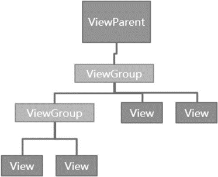
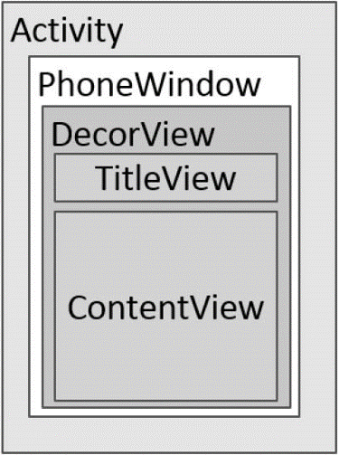
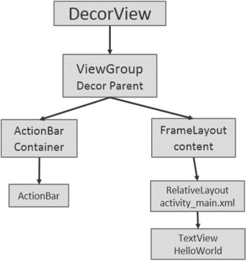
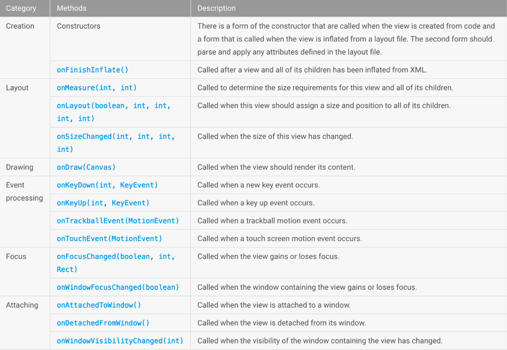
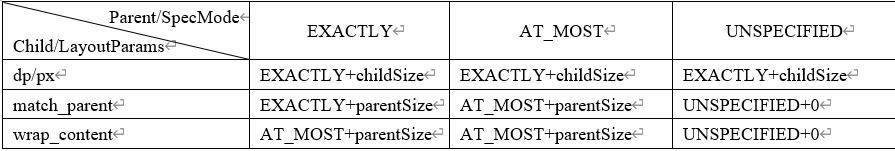
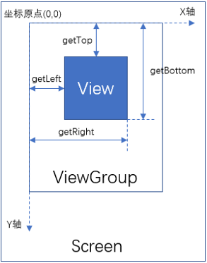

## 布局结构
Android中的每个控件都会在界面中占得一块矩形的区域，而在Android中，控件大致被分为两类，即ViewGroup控件与View控件。ViewGroup控件作为父控件可以包含多个View控件，并管理其包含的View控件。通过ViewGroup整个界面上的控件形成一个树形结构， 这也就是我们常说的控件树，上层控件负责下层子控件的测量与绘制，并传递交互事件。通常在Activity中使用的findViewByld()方法，就是在控件树中以树的深度优先遍历来查找对应元素。在每棵控件树的顶部，都有一个ViewParent对象，这就是整棵树的控制核心，所有的交互管理事件都由它来统一调度和分配 从而可以对整个视图进行整体控制。  


通常情况下，在Activity中使用setContentView方法来设置一个布局，在调用该方法后，布局内容才真正地显示出来。那么setContentView方法具体做了些什么呢？首先，我们来看一下Android界面的架构图：  


每个Activity都包含一个Window对象，在Android中Window对象通常由PhoneWindow来实现。PhoneWindow将一个DecorView设置为整个应用窗口的根View。DecorView作为窗口界面的顶层视图，封装了一些窗口操作的通用方法。可以说，DecorView将要显示的具体内容呈现在了PhoneWindow上，这里面的所有View的监听事件，都通过WindowManagerService来进行接收，并通过Activity对象来回调相应的onClickListener。在显示上，它将屏幕分成两部分，一个是TitleView，另一个是ContentView。看到这里，大家一定看见了一个非常熟悉的布局——ContentView。它是一个ID为content的Framelayout，activity_main.xml就是设置在这样一个Framelayout里。通过以上过程，我们可以建立起这样一个标准视图树：  

视图树的第二层装载了一个LinearLayout，作为ViewGroup，这一层的布局结构会根据对应的参数设置不同的布局，如最常用的布局——上面显示TitleBar下面是Content这样的布局，而如果用户通过设置requestWindowFeature（Window.FEATURE_ NO_TITLE)来设置全屏显示，视图树中的布局就只有Content了，这就解释了为什么调用requestWindowFeature()方法一定要在调用setContentView()方法之前才能生效的原因。  
在代码中，当程序在onCreate方法中调用setContentView()方法后，ActivityManagerService会回调onResume()方法，此时系统才会把整个DecorView添加到PhoneWindow中，并让其显示出来，从而最终完成界面的绘制。

## View的绘制过程
View绘制过程中框架调用的一些标准方法概要图：  

在上图中，View的绘制过程主要包括三个：测量，布局和绘制，下面会重点讲解；

### 测量
在现实生活中，如果我们要去画一个图形，就必须知道它的大小。同样，Android系统在绘制View前，也必须对View进行测量，即告诉系统该画一个多大的View。  
#### 1、View中默认的测量逻辑。
在View中与测量相关的方法有measure和onMeasure两个方法，其中measure方法主要逻辑调用了onMeasure方法，所以onMeasure方法才是View测量自身尺寸的核心方法；
```
protected void onMeasure(int widthMeasureSpec, int heightMeasureSpec) {
    setMeasuredDimension(getDefaultSize(getSuggestedMinimumWidth(), widthMeasureSpec),
            getDefaultSize(getSuggestedMinimumHeight(), heightMeasureSpec));
}
```
其中widthMeasureSpec表示父控件强加于子控件的宽度限制，heightMeasureSpec表示父控件强加于子控件的高度限制；setMeasuredDimension方法会把计算的控件宽高记录在mMeasuredWidth和mMeasuredHeight属性，可见，自定义控件时，测量的最终尺寸是由此方法确定的：
```
private void setMeasuredDimensionRaw(int measuredWidth, int measuredHeight) {
    mMeasuredWidth = measuredWidth;
    mMeasuredHeight = measuredHeight;

    mPrivateFlags |= PFLAG_MEASURED_DIMENSION_SET;
}
```
而getDefaultSize方法的逻辑如下：
```
public static int getDefaultSize(int size, int measureSpec) {
    int result = size;
    int specMode = MeasureSpec.getMode(measureSpec);
    int specSize = MeasureSpec.getSize(measureSpec);

    switch (specMode) {
    case MeasureSpec.UNSPECIFIED://父控件未给出尺寸限制
        result = size;
        break;
    case MeasureSpec. AT_MOST://父控件给出一个允许的最大值的尺寸限制
    case MeasureSpec.EXACTLY://父控件给出一个精确值尺寸限制
        result = specSize;
        break;
    }
    return result;
}
```
其实就是当父控件给出的尺寸限制模式为AT_MOST或EXACTLY时，用父控件给的尺寸限制中的尺寸，父控件没有尺寸限制时，用建议的尺寸；注意，最终测量出来的尺寸并非与测量过程中的尺寸一样带有mode，而是一个真正的int数值；

#### 2、测量过程中控件尺寸的表示方法
通过上面的分析可知，父控件给子View的尺寸是用一个int值表示的，但是这个int值有点特殊，它的高2位表示测量模式（SpecMode），低30位表示测试大小（SpecSize），我们可以通过MeasureSpec类来打包和解包这个int值，下面是MeasureSpec的部分代码：
```
private static final int MODE_SHIFT = 30;
private static final int MODE_MASK = 0x3 << MODE_SHIFT;
public static final int UNSPECIFIED = 0 << MODE_SHIFT;
public static final int EXACTLY = 1 << MODE_SHIFT;
public static final int AT_MOST = 2 << MODE_SHIFT;
public static int makeMeasureSpec(int size,int mode) {
    if (sUseBrokenMakeMeasureSpec) {
        return size + mode;
    } else {
        return (size & ~MODE_MASK) | (mode & MODE_MASK);
    }
}
public static int getMode(int measureSpec) {
    return (measureSpec & MODE_MASK);
}
public static int getSize(int measureSpec) {
    return (measureSpec & ~MODE_MASK);
}
```
其中测量的模式只有以下三种：
- EXACTLY：表示父容器给出了一个精确的大小，例如10dp或match_parent这样的值。
- AT_MOST：表示父容器给出了一个可用大小，View的大小不能大于这个值，例如wrap_content。
- UNSPECIFIED：父容器不对View有任何限制；

#### 3、ViewGroup中默认的测量逻辑
从上面的分析中可以看到，子控件的尺寸用到了父控件给定的尺寸限制，所以我们先去追溯一下父控件是如何计算子控件的尺寸限制的，但是在ViewGroup中，并没有重写measure和onMeasure方法，由此可见，计算子控件尺寸限制的逻辑肯定在ViewGourp的子类当中，这里我们去查看FrameLayout的measure和onMeasure方法，其中measure方法在FrameLayout中依然没有重写，所以FrameLayout测量的逻辑同样在onMeasure方法中：
```
protected void onMeasure(int widthMeasureSpec, int heightMeasureSpec) {
    int count = getChildCount();
    …
    //遍历所有子控件
    for (int i = 0; i < count; i++) {
        final View child = getChildAt(i);
        //排除不可见的控件
        if (mMeasureAllChildren || child.getVisibility() != GONE) {
            //通过本控件的padding和尺寸限制，再加上子控件的margin和尺寸，计算尺寸限制设置到子控件中
            measureChildWithMargins(child, widthMeasureSpec, 0, heightMeasureSpec, 0);
            …
        }
}
…
}
```
再看measureChildWithMargins的实现：
```
protected void measureChildWithMargins(View child,
        int parentWidthMeasureSpec, int widthUsed,
        int parentHeightMeasureSpec, int heightUsed) {
    //获取子控件的布局参数
    final MarginLayoutParams lp = (MarginLayoutParams) child.getLayoutParams();
    //通过父控件的padding、尺寸限制和子控件的布局参数，计算子控件的尺寸限制
    final int childWidthMeasureSpec = getChildMeasureSpec(parentWidthMeasureSpec,
            mPaddingLeft + mPaddingRight + lp.leftMargin + lp.rightMargin
                    + widthUsed, lp.width);
    final int childHeightMeasureSpec = getChildMeasureSpec(parentHeightMeasureSpec,
            mPaddingTop + mPaddingBottom + lp.topMargin + lp.bottomMargin
                    + heightUsed, lp.height);
    //将尺寸限制设置到子控件中，也即调用子控件的onMeasure方法
    child.measure(childWidthMeasureSpec, childHeightMeasureSpec);
}
```
由此可见，决定子控件宽高的因素其实有两个，一个是其自身的布局参数LayoutParams，另一个是其父控件的尺寸限制，这两个因素共同决定子控件宽高的测量模式和测量大小，然后通过MeasureSpec打包成测量宽高，传递给View的measure方法； 具体计算逻辑在getChildMeasureSpec方法中：
```
public static int getChildMeasureSpec(int spec, int padding, int childDimension) {
    int specMode = MeasureSpec.getMode(spec);
    int specSize = MeasureSpec.getSize(spec);

    int size = Math.max(0, specSize - padding);

    int resultSize = 0;
    int resultMode = 0;

    switch (specMode) {
    // Parent has imposed an exact size on us
    case MeasureSpec.EXACTLY:
        if (childDimension >= 0) {
            resultSize = childDimension;
            resultMode = MeasureSpec.EXACTLY;
        } else if (childDimension == LayoutParams.MATCH_PARENT) {
            // Child wants to be our size. So be it.
            resultSize = size;
            resultMode = MeasureSpec.EXACTLY;
        } else if (childDimension == LayoutParams.WRAP_CONTENT) {
            // Child wants to determine its own size. It can't be
            // bigger than us.
            resultSize = size;
            resultMode = MeasureSpec.AT_MOST;
        }
        break;

    // Parent has imposed a maximum size on us
    case MeasureSpec.AT_MOST:
        if (childDimension >= 0) {
            // Child wants a specific size... so be it
            resultSize = childDimension;
            resultMode = MeasureSpec.EXACTLY;
        } else if (childDimension == LayoutParams.MATCH_PARENT) {
            // Child wants to be our size, but our size is not fixed.
            // Constrain child to not be bigger than us.
            resultSize = size;
            resultMode = MeasureSpec.AT_MOST;
        } else if (childDimension == LayoutParams.WRAP_CONTENT) {
            // Child wants to determine its own size. It can't be
            // bigger than us.
            resultSize = size;
            resultMode = MeasureSpec.AT_MOST;
        }
        break;

    // Parent asked to see how big we want to be
    case MeasureSpec.UNSPECIFIED:
        if (childDimension >= 0) {
            // Child wants a specific size... let him have it
            resultSize = childDimension;
            resultMode = MeasureSpec.EXACTLY;
        } else if (childDimension == LayoutParams.MATCH_PARENT) {
            // Child wants to be our size... find out how big it should
            // be
            resultSize = View.sUseZeroUnspecifiedMeasureSpec ? 0 : size;
            resultMode = MeasureSpec.UNSPECIFIED;
        } else if (childDimension == LayoutParams.WRAP_CONTENT) {
            // Child wants to determine its own size.... find out how
            // big it should be
            resultSize = View.sUseZeroUnspecifiedMeasureSpec ? 0 : size;
            resultMode = MeasureSpec.UNSPECIFIED;
        }
        break;
    }
    //noinspection ResourceType
    return MeasureSpec.makeMeasureSpec(resultSize, resultMode);
}
```
getChildMeasureSpec清楚展示了普通View的MeasureSpec的创建规则，为了更清晰地理解getChildMeasureSpec的逻辑，这里提供一个表，表中对getChildMeasureSpec的工作原理进行了梳理：  

当View采用固定宽/高的时候，不管父容器的MeasureSpec是什么，View的MeasureSpec都是精确模式并且其大小遵循Layoutparams中的大小。当View的宽/高是match_parent时，如果父容器的模式是精准模式，那么View也是精准模式并且其大小是父容器的剩余空间；如果父容器是最大模式，那么View也是最大模式并且其大小不会超过父容器的剩余空间。当View的宽/高是wrap_content时，不管父容器的模式是精准还是最大化，View的模式总是最大化并且大小不能超过父容器的剩余空间。

#### 4、以LinearLayout为例介绍父控件的测量过程
上面主要介绍了子控件的测试过程和子控件的尺寸限制是怎么来的，下面详细介绍父控件是如何计算自身的尺寸的，首先来看LinearLayout的onMeasure方法，如下所示：
```
protected void onMeasure(int widthMeasureSpec, int heightMeasureSpec) {
    if (mOrientation == VERTICAL) {
        measureVertical(widthMeasureSpec, heightMeasureSpec);
    } else {
        measureHorizontal(widthMeasureSpec, heightMeasureSpec);
    }
}
```
上面的代码分了两个方向来测量，我们选择垂直方向进行测量分析，这个方法比较长，下面是部分代码：
```
// See how tall everyone is. Also remember max width.
for (int i = 0; i < count; ++i) {
    final View child = getVirtualChildAt(i);
...
    // Determine how big this child would like to be. If this or
    // previous children have given a weight,then we allow it to
    // use all available space (and we will shrink things later
    // if needed).
    measureChildBeforeLayout(
            child,i,widthMeasureSpec,0,heightMeasureSpec,
            totalWeight == 0 ? mTotalLength : 0);
    if (oldHeight != Integer.MIN_VALUE) {
        lp.height = oldHeight;
    }
    final int childHeight = child.getMeasuredHeight();
    final int totalLength = mTotalLength;
    mTotalLength=Math.max(totalLength,totalLength+childHeight+lp.topMargin +
            lp.bottomMargin + getNextLocationOffset(child));
}
```
从上面这段代码可以看出，系统会遍历子元素并对每个子元素执行measureChildBeforeLayout方法，这个方法内部会调用子元素的measure方法，这样各个子元素就开始依次进入measure过程，并且系统会通过mTotalLength这个变量来存储LinearLayout在竖直方向的初步高度。每测量一个子元素，mTotalLength就会增加，增加的部分主要包括了子元素的高度以及子元素在竖直方向上的margin等。当子元素测量完毕后，LinearLayout会测量自己的大小，源码如下所示：
```
// Add in our padding
mTotalLength += mPaddingTop + mPaddingBottom;
int heightSize = mTotalLength;
// Check against our minimum height
heightSize = Math.max(heightSize,getSuggestedMinimumHeight());
// Reconcile our calculated size with the heightMeasureSpec
int heightSizeAndState=resolveSizeAndState(heightSize,heightMeasureSpec, 0);
heightSize = heightSizeAndState & MEASURED_SIZE_MASK;
...
setMeasuredDimension(resolveSizeAndState(maxWidth,widthMeasureSpec, childState), heightSizeAndState);
```
当子元素测量完毕后，LinearLayout会根据子元素的情况来测量自己的大小。针对竖直的LinearLayout而言，它在水平方向的测量过程遵循View的测量过程，在竖直方向的测量过程则和View有所不同。具体来说是指，如果它的布局中高度采用的是match_parent或者具体数值，那么它的测量过程和View一致，即高度为specSize；如果它的布局中高度采用的是wrap_content，那么它的高度是所有子元素所占用的高度总和，但是仍然不能超过它的父容器的剩余空间，当然它的最终高度还需要考虑其在竖直方向的padding;

#### 5、在Activity启动过程获取View的测量宽高
在实际测试中，Activity的onCreate、onStart、onResume中均无法正确得到某个View的宽/高信息，这是因为View的measure过程和Activity的生命周期方法不是同步执行的，因此无法保证Activity执行了onCreate、onStart、onResume时某个View已经测量完毕了，如果View还没有测量完毕，那么获得的宽/高就是0。有没有什么方法能，这里给出四种方法来解决这个问题：
- Activity/View#onWindowFocusChanged
这个方法的含义是：View已经初始化完毕了，宽/高已经准备好了，这个时候去获取宽/高是没问题的。需要注意的是，onWindowFocusChanged会被调用多次，当Activity的窗口得到焦点和失去焦点时均会被调用一次。具体来说，当Activity继续执行和暂停执行时，onWindowFocusChanged均会被调用，如果频繁地进行onResume和onPause，那么onWindowFocusChanged也会被频繁地调用；
- view.post(runnable)
通过post可以将一个runnable投递到消息队列的尾部，然后等待Looper调用此runnable的时候，View也已经初始化好了；
- ViewTreeObserver
使用ViewTreeObserver的众多回调可以完成这个功能，比如使用OnGlobalLayoutListener这个接口，当View树的状态发生改变或者View树内部的View的可见性发现改变时，onGlobalLayout方法将被回调，因此这是获取View的宽/高一个很好的时机。需要注意的是，伴随着View树的状态改变等，onGlobalLayout会被调用多次。
```
protected void onStart() {
    super.onStart();
    ViewTreeObserver observer = view.getViewTreeObserver();
    observer.addOnGlobalLayoutListener(new OnGlobalLayoutListener() {
        @SuppressWarnings("deprecation")
        @Override
        public void onGlobalLayout() {
            view.getViewTreeObserver().removeGlobalOnLayoutListener(this);
            int width = view.getMeasuredWidth();
            int height = view.getMeasuredHeight();
        }
    });
}
```
- view.measure(int widthMeasureSpec,int heightMeasureSpec)
通过手动对View进行measure来得到View的宽/高。这种方法比较复杂，需要分情况处理；

View获取测量后的宽高：
方法 | 说明
:- | :-
getHeight()	| 控件的高
getWidth() | 控件的宽

总结，View的measure过程是三大流程中最复杂的一个，measure完成以后，通过getMeasuredWidth/Height方法就可以正确地获取到View的测量宽/高。需要注意的是，在某些极端情况下，系统可能需要多次measure才能确定最终的测量宽/高，在这种情形下，在onMeasure方法中拿到的测量宽/高很可能是不准确的。一个比较好的习惯是在onLayout方法中去获取View的测量宽/高或者最终宽/高。

### 布局
当控件的大小确定之后，就需要确定控件的位置，这时候就会调用控件的layout方法，这个方法定义了控件自身位置的逻辑，一般情况下View或ViewGroup都不会去修改，而在layout方法中会调用onLayout方法，这个定义了子控件的位置逻辑，对于自定义ViewGroup就需要重写此方法，对于View，onLayout就是一个空方法；  
由此可知，自定义View不需要定义布局逻辑，自定义ViewGroup只需要定义onLayout方法中的逻辑；

#### 1、View默认的layout逻辑
```
public void layout(int l, int t, int r, int b) {
    …
    //保存上一次布局的左上右下，当然是相对父控件
    int oldL = mLeft;
    int oldT = mTop;
    int oldB = mBottom;
    int oldR = mRight;
    //判断布局模式，再进行位置设定
    boolean changed = isLayoutModeOptical(mParent) ?
            setOpticalFrame(l, t, r, b) : setFrame(l, t, r, b);
    //如果当前控件布局位置有变化或需要重新布局，那么子控件也需要重新布局
    if (changed || (mPrivateFlags & PFLAG_LAYOUT_REQUIRED) == PFLAG_LAYOUT_REQUIRED) {
        onLayout(changed, l, t, r, b);//对于View来说，这个方法是空方法
        //是否绘制滚动条
        if (shouldDrawRoundScrollbar()) {
            if(mRoundScrollbarRenderer == null) {
                mRoundScrollbarRenderer = new RoundScrollbarRenderer(this);
            }
        } else {
            mRoundScrollbarRenderer = null;
        }

        mPrivateFlags &= ~PFLAG_LAYOUT_REQUIRED;
        //布局完成后的监听回调
        ListenerInfo li = mListenerInfo;
        if (li != null && li.mOnLayoutChangeListeners != null) {
            ArrayList<OnLayoutChangeListener> listenersCopy =
                    (ArrayList<OnLayoutChangeListener>)li.mOnLayoutChangeListeners.clone();
            int numListeners = listenersCopy.size();
            for (int i = 0; i < numListeners; ++i) {
                listenersCopy.get(i).onLayoutChange(this, l, t, r, b, oldL, oldT, oldR, oldB);
            }
        }
}
…
}
```
其中设置控件自身位置的该当是setFrame，这个方法需要传入左上右下的位置，即更新mLeft、mRight、mTop和mBottom这四个值，具体实现如下：
```
protected boolean setFrame(int left, int top, int right, int bottom) {
    boolean changed = false;
    //当左上右下四个位置有任意一个不同时
    if (mLeft != left || mRight != right || mTop != top || mBottom != bottom) {
        changed = true;

        // Remember our drawn bit
        int drawn = mPrivateFlags & PFLAG_DRAWN;
        //计算出旧布局的尺寸和新布局的尺寸
        int oldWidth = mRight - mLeft;
        int oldHeight = mBottom - mTop;
        int newWidth = right - left;
        int newHeight = bottom - top;
        boolean sizeChanged = (newWidth != oldWidth) || (newHeight != oldHeight);

        //更新布局位置
        invalidate(sizeChanged);

        mLeft = left;
        mTop = top;
        mRight = right;
        mBottom = bottom;
        mRenderNode.setLeftTopRightBottom(mLeft, mTop, mRight, mBottom);

        mPrivateFlags |= PFLAG_HAS_BOUNDS;

        //回调onSizeChange方法
        if (sizeChanged) {
            sizeChange(newWidth, newHeight, oldWidth, oldHeight);
        }
     …
    }
    return changed;
}
```
#### 2、ViewGroup默认的layout逻辑
通过上面的分析可知，子控件的layout方法有四个参数，分别对应左上右下四个位置，而这些参数是由父控件传入的，所以，有必要分析一下ViewGroup的默认layout逻辑：
```
@Override
public final void layout(int l, int t, int r, int b) {
    if (!mSuppressLayout && (mTransition == null || !mTransition.isChangingLayout())) {
        if (mTransition != null) {
            mTransition.layoutChange(this);
        }
        super.layout(l, t, r, b);
    } else {
        // record the fact that we noop'd it; request layout when transition finishes
        mLayoutCalledWhileSuppressed = true;
    }
}
```
除了一些判断条件，依然是调用了View的layout逻辑；而ViewGroup中的onLayout方法只是一个抽象方法，所以真正的布局逻辑需要在ViewGroup的子类中查看，这里以LinearLayout为例，发现LinearLayout中并没有重写ViewGroup中的layout方法，但对onLayout方法进行了重写：
```
protected void onLayout(boolean changed, int l, int t, int r, int b) {
    if (mOrientation == VERTICAL) {
        layoutVertical(l, t, r, b);
    } else {
        layoutHorizontal(l, t, r, b);
    }
}
```
LinearLayout中onLayout的实现逻辑和onMeasure的实现逻辑类似，这里选择layoutVertical继续讲解，为了更好地理解其逻辑，这里只给出了主要的代码：
```
void layoutVertical(int left, int top, int right, int bottom) {
    ...
    for (int i = 0; i < count; i++) {
        final View child = getVirtualChildAt(i);
        if (child == null) {
            childTop += measureNullChild(i);
        } else if (child.getVisibility() != GONE) {
            final int childWidth = child.getMeasuredWidth();
            final int childHeight = child.getMeasuredHeight();

            final LinearLayout.LayoutParams lp =
                    (LinearLayout.LayoutParams) child.getLayoutParams();

            int gravity = lp.gravity;
            if (gravity < 0) {
                gravity = minorGravity;
            }
            final int layoutDirection = getLayoutDirection();
            final int absoluteGravity = Gravity.getAbsoluteGravity(gravity, layoutDirection);
            switch (absoluteGravity & Gravity.HORIZONTAL_GRAVITY_MASK) {
                case Gravity.CENTER_HORIZONTAL:
                    childLeft = paddingLeft + ((childSpace - childWidth) / 2)
                            + lp.leftMargin - lp.rightMargin;
                    break;

                case Gravity.RIGHT:
                    childLeft = childRight - childWidth - lp.rightMargin;
                    break;

                case Gravity.LEFT:
                default:
                    childLeft = paddingLeft + lp.leftMargin;
                    break;
            }

            if (hasDividerBeforeChildAt(i)) {
                childTop += mDividerHeight;
            }

            childTop += lp.topMargin;
            setChildFrame(child, childLeft, childTop + getLocationOffset(child),
                    childWidth, childHeight);
            childTop += childHeight + lp.bottomMargin + getNextLocationOffset(child);

            i += getChildrenSkipCount(child, i);
        }
    }
}
```
可以看到，此方法会遍历所有子元素并调用setChildFrame方法来为子元素指定对应的位置，其中childTop会逐渐增大，这就意味着后面的子元素会被放置在靠下的位置，这刚好符合竖直方向的LinearLayout的特性。至于setChildFrame，它仅仅是调用子元素的layout方法而已，这样父元素在layout方法中完成自己的定位以后，就通过onLayout方法去调用子元素的layout方法，子元素又会通过自己的layout方法来确定自己的位置，这样一层一层地传递下去就完成了整个View树的layout过程。setChildFrame方法的实现如下所示。
```
private void setChildFrame(View child, int left, int top, int width, int height) {
    child.layout(left, top, left + width, top + height);
}
```
而在layout方法中会通过setFrame去设置子元素的四个顶点的位置，在setFrame中有如下几句赋值语句，这样一来子元素的位置就确定了：
```
mLeft = left;
mTop = top;
mRight = right;
mBottom = bottom;
```
问题，View的测量宽/高和最终/宽高有什么区别？  
这个问题可以具体为：View的getMeasuredWidth和getWidth这两个方法有什么区别，至于getMeasuredHeight和getHeight的区别和前两者完全一样。为了回答这个问题，首先，我们看一下getwidth和getHeight这两个方法的具体实现：
```
public final int getWidth() {
    return mRight -mLeft;
}
public final int getHeight() {
    return mBottom -mTop;
}
```
从getWidth和getHeight的源码再结合mLeft、mRight、mTop和mBottom这四个变量的赋值过程来看，getWidth和getHeight方法获取的尺寸其实与测量后的尺寸相等，只是产生的时机不一样，getWidth和getHeight方法只能在布局完成后才能正确获取控件的尺寸，而getMeasuredWidth在测量完成后就可以。

#### 3、布局参考的坐标系
要把一个控件放在某一个位置，就需要参考一个坐标系，控件布局参考的坐标系是父视图坐标系：  
  
在View中可以调用getLeft、getRight、getTop和getBottom方法获取控件在父视图坐标系中的位置；除此之外，还有getX和getY方法，这两个方法也是以父视图坐标系为参考，在当前控件没有偏移（Translation）的情况下，getX = getLeft，getY = getTop；如果有偏移，则getX = getLeft + getTranslationX，getY = getTop + getTranslationY；而getTranslationX和getTranslationY
这两个方法是获取当前控件的偏移量，在属性动画平移会操作这两个值；

### 绘制
#### 1、绘制的过程
Draw过程就比较简单了，它的作用是将View绘制到屏幕上面。View的绘制过程遵循如下几步：
1. 绘制背景background.draw(canvas)。
2. 绘制自己（onDraw）。
3. 绘制children（dispatchDraw）。
4. 绘制装饰（onDrawScrollBars）。

View绘制过程的传递是通过dispatchDraw来实现的，dispatchDraw会遍历调用所有子元素的draw方法，如此draw事件就一层层地传递了下去。

#### 2、绘制参考的坐标系
要绘制一个控件，也是需要参考一个坐标系的，这个坐标系就是以控件左上角为圆点，向右为X轴正方向，向下为Y轴正方向，当然这只是默认情况，在onDraw方法的Canvas中，提供了平移，旋转和缩放坐标系的方法，可见，控件绘制的坐标系其实是Canvas默认的坐标系；

## 定义控件
定义控件可以分为三种方式：
- 一种是将各控件组合在一起形成一个自己的控件，称为组合控件；
- 一种是继承已有的控件，修改其中的部分功能；
- 一种是继承View或ViewGroup控件，完全重写测量、布局和绘制方法； 
