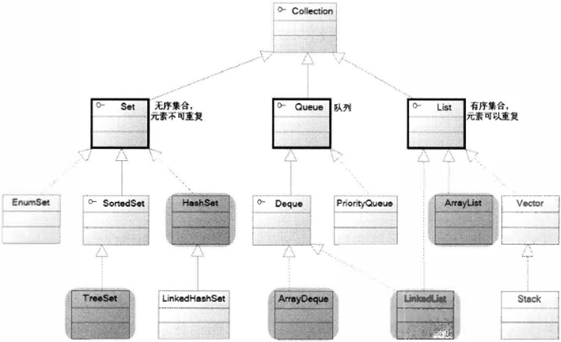
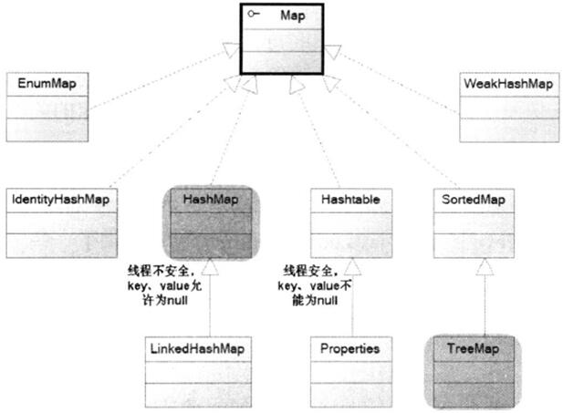

## 派生自Collection接口
Java 的集合类主要由两个接口派生而出： Collection 和Map, Collection 和Map 是Java 集合框架的根接口， 这两个接口又包含了一些子接口或实现类。如图所示是Collection 接口、子接口及其实现类的继承树。

上图显示了Collection 体系里的集合， 其中粗线圈出的Set 和List 接口是Collection 接口派生的两个子接口， 它们分别代表了无序集合和有序集合； Queue 是Java 提供的队列实现，有点类似于List；

## 派生自Map接口
下图显示了Map 接口的众多实现类，这些实现类在功能、用法上存在一定的差异，但它们都有一个功能特征： Map 保存的每项数据都是key-value 对，也就是由key 和value 两个值组成。Map 里的key 是不可重复的，key 用于标识集合里的每项数据，如果需要查阅Map中的数据时，总是根据Map 的key 来获取。
