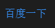

Markdown语法：<https://www.jianshu.com/p/ebe52d2d468f>
# 标题
Markdown用`#空格`来表示标题，最多6级标题
```
# 一级标题
## 二级标题
### 三级标题
#### 四级标题
##### 五级标题
###### 六级标题
```
# 缩进、换行、空行、对齐方式
## 缩进
```
&emsp;或&#8195; //全角
&ensp;或&#8194; //半角
&nbsp;或&#160;  //半角之半角
```
## 换行
由于markdown编辑器的不同,可能在一行字后面，直接换行回车，也能实现换行，但是在Visual Studio Code上，想要换行必须得在一行字后面空两个格子才行。
## 空行
空一行或者空多行都表示一个空行；
## 对齐方式
语法如下：
```
<center>行中心对齐</center>
<p align="left">行左对齐</p>
<p align="right">行右对齐</p>
```
显示效果：


# 斜体、粗体、删除线、下划线、背景高亮
```
*斜体*或_斜体_
**粗体**
***加粗斜体***
~~删除线~~
++下划线++
==背景高亮==
```
# 超链接、页内链接、注脚
## 超链接
最简单的链接方式，只要是用<>包起来， Markdown 就会自动把它转成链接。一般网址的链接文字就和链接地址一样：
```
<http://www.baidu.com>
```
显示效果：  


[]里写链接文字，()里写链接地址, ()中的""中可以为链接指定title属性，title属性可加可不加。title属性的效果是鼠标悬停在链接上会出现指定的 title文字，链接地址与title前有一个空格。
语法如下：
```
[百度一下](http://www.baidu.comm "百度")
```
显示效果：  


## 页内链接

