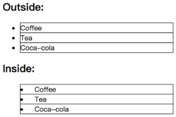

## 常规列表项标记
list-style-type属性指定列表项标记的类型：
- none	无标记。
- disc	默认。标记是实心圆。
- circle	标记是空心圆。
- square	标记是实心方块。
- decimal	标记是数字。
- decimal-leading-zero	0开头的数字标记。(01, 02, 03, 等。)
- lower-roman	小写罗马数字(i, ii, iii, iv, v, 等。)
- upper-roman	大写罗马数字(I, II, III, IV, V, 等。)
- lower-alpha	小写英文字母The marker is lower-alpha (a, b, c, d, e, 等。)
- upper-alpha	大写英文字母The marker is upper-alpha (A, B, C, D, E, 等。)
- lower-greek	小写希腊字母(alpha, beta, gamma, 等。)
- lower-latin	小写拉丁字母(a, b, c, d, e, 等。)
- upper-latin	大写拉丁字母(A, B, C, D, E, 等。)
```
ul {
  list-style-type: circle
}
```

## 图片列表项标记
list-style-image 属性使用图像来替换列表项的标记。
- url	图像的路径。
- none	 默认。无图形被显示。
- inherit	规定应该从父元素继承 list-style-image 属性的值。
```
ul {
  list-style-image: url('sqpurple.gif');
}
```
上面的例子在所有浏览器中显示并不相同，IE和Opera显示图像标记比火狐，Chrome和Safari更高一点点。
如果你想在所有的浏览器放置同样的形象标志，就应使用浏览器兼容性解决方案，过程如下：
```
ul{
    list-style-type: none;
    padding: 0px;
    margin: 0px;
}
ul li{
    background-image: url(sqpurple.gif);
    background-repeat: no-repeat;
    background-position: 0px 5px; 
    padding-left: 14px; 
}
```
## 列表项标记位置
list-style-position属性指示如何相对于对象的内容绘制列表项标记。
- inside	列表项目标记放置在文本以内，且环绕文本根据标记对齐。
- outside	默认值。保持标记位于文本的左侧。列表项目标记放置在文本以外，且环绕文本不根据标记对齐。
- inherit	规定应该从父元素继承 list-style-position 属性的值。

```
ul {
  list-style-position: inside;
}
```

## 列表属性简写
list-style简写属性可以在一个声明中设置所有的列表属性。  
可以设置的属性（按顺序）： list-style-type, list-style-position, list-style-image.  
可以不设置其中的某个值，比如 "list-style:circle inside;" 也是允许的。未设置的属性会使用其默认值。  
```
ul {
  list-style: square inside;
}
```


