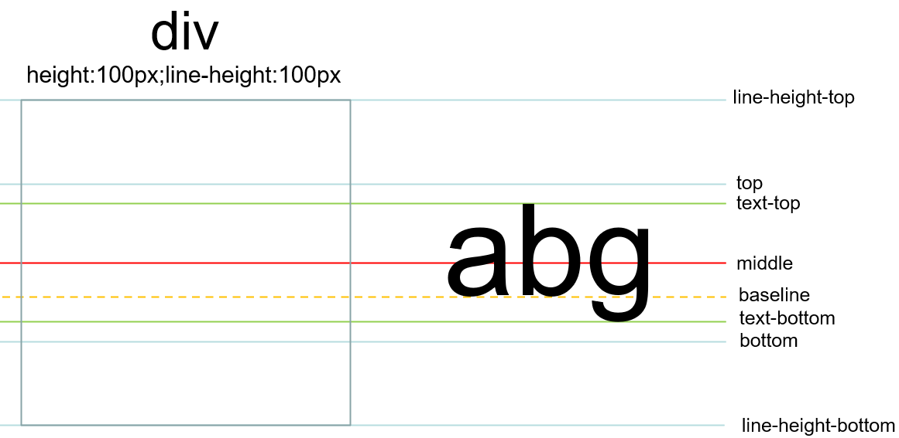
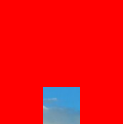

CSS 尺寸 (Dimension) 属性允许你控制元素的高度和宽度。

## 宽度
width属性设置元素的宽度。
- auto	默认值。浏览器可计算出实际的宽度。
- length	使用 px、cm 等单位定义宽度。
- %	定义基于包含块（父元素）宽度的百分比宽度。
- inherit	规定应该从父元素继承 width 属性的值。
```
p {
  width: 100px;
}
```
注意： width属性不包括内边距，边框和外边距！

## 最大宽度
max-width属性设置元素的最大可能宽度。
- none	默认。定义对元素的最大宽度没有限制。
- length	定义元素的最大宽度值。
- %	定义基于包含它的块级对象的百分比最大宽度。
- inherit	规定应该从父元素继承 max-width 属性的值。
```
p {
  max-width: 100px;
}
```

## 最小宽度
min-width属性设置元素的最小宽度。
- length	定义元素的最小宽度值。默认值：取决于浏览器。
- %	定义基于包含它的块级对象的百分比最小宽度。
- inherit	规定应该从父元素继承 min-width 属性的值。
```
p{
min-width:1000px;
}
```

## 高度
height属性设置元素的高度。
- auto	默认。浏览器会计算出实际的高度。
- length	使用 px、cm 等单位定义高度。
- %	基于包含它的块级对象的百分比高度。
- inherit	规定应该从父元素继承 height 属性的值。
```
p {
  height: 100px;
  width: 100px;
}
```
注意： height属性不包括内边距，边框，或外边距！

## 最大高度
max-height 属性设置元素的最大高度。
- none	默认。定义对元素被允许的最大高度没有限制。
- length	定义元素的最大高度值。
- %	定义基于包含它的块级对象的百分比最大高度。
- inherit	规定应该从父元素继承 max-height 属性的值。
```
p{
    max-height:50px;
}
```

## 最小高度
min-height 属性设置元素的最低高度。
- length	定义元素的最小高度。默认值是 0。
- %	定义基于包含它的块级对象的百分比最小高度。
- inherit	规定应该从父元素继承 min-height 属性的值。
```
p{
    min-height:100px;
}
```
## 行高
line-height设置每一行的高度；
- normal：默认。设置合理的行间距。
- number：设置数字，可以是小数，此数字会与当前元素的字体尺寸相乘来设置行间距。
- length：设置固定的行间距。
- %：基于body字体尺寸的百分比行间距。
- inherit：规定应该从父元素继承 line-height 属性的值。
```
p.small {
  line-height: 10px
}
p.big {
  line-height: 30px
}
```
对于容器元素的行高，其大小取决于元素中字体样式的font-size属性（一般情况下，元素没有明确指定font-size属性，但是有文档默认的属性可以继承），行高的参考线与字体样式的关系如下：   
  
从上图可见，div元素的行高参考线与字体的行高参考线是一致的，默认在div的顶端，如果此时指定div的行高为100px，div的行高参考线会变成如下所示：  
  
当元素高度与行高相等时，行高的line-height-top参考线和line-height-bottom参考线与元素的上下边对齐，其他行高参考线就会自动在line-height-top与line-height-bottom之间居中；

## 行高参考线与元素大小的关系
使用vertical-align属性对齐时，元素在垂直方向上的位置取决于行高五条参考线的位置，而行高五条参考线在文字大小确认后，这五条参考线的相对距离就固定了下来，但整体的位置会随其中的元素大小变化；

1、当元素与baseline对齐时


这里就可以解释img元素在div中底部总会有一段留白的问题：
```
div {
	border: 1px red solid;
}
<div></div>
```


因为默认情况下，img元素的vertical-align属性值为baseline，留白的高度实际是baseline到bottom的距离，所以要消除留白，只需要将img元素的vertical-align设置为bottom即可；

2、当元素与top对齐时


3、当元素与中心线对齐


4、当元素与bottom对齐时


## 垂直对齐
对于文本元素，用行高的方式是很难精确做到bottom对齐的，因为行高参考线很难精确的移动到元素底部，但是对于img元素却可以做到bottom对齐，因为img元素的bottom对齐，参考的基线是行高参考线中的line-height-bottom，下面是一个img元素在div元素里面垂直居中的例子：
```
<head>
    <title>Document</title>
    <style>
        div {
            width: 100px;
            height: 100px;
            background-color: red;
            text-align: center;
            line-height: 100px;
        }
        img{
            width: 30px;
            height: 30px;
            vertical-align: bottom;
        }
    </style>
</head>
<body>
    <div></div>
</body>
```
效果如下：  


下面的例子可以帮助理解文本元素和img元素使用line-height垂直对齐的特点：
```
div {
  background-color: deepskyblue;
  margin-top: 10px;
  height: 100px;
}
img {
  background-color: red;
  vertical-align: baseline; /*默认，可以不传*/
}
.box3 {
  line-height: 100px;
}
<div class="box1"></div>
<div class="box2">有文本，没有行高</div>
<div class="box3"></div>
```
运行效果如下：


当vertical-align:top时，运行效果如下：


当vertical-align:text-top时，运行效果如下：


当vertical-align:middle时，运行效果如下：


当vertical-align:text-bottom时，运行效果如下：


当vertical-align:bottom时，运行效果如下：


