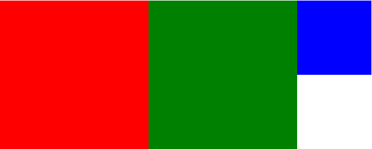

## 标准流
在页面中元素默认的显示方式就是标准流的显示方式，例如块元素占一整行，行内元素和行内块元素可在同一行；

## 浮动规则

浮动的基本规则：
- 元素的浮动分为左浮动和右浮动，意味着元素只能左右移动而不能上下移动。
- 浮动元素会尽量向左或向右移动，直到它的外边缘碰到包含框或另一个浮动框的边框为止。
- 浮动元素之后，元素周围的元素将重新排列；
- 浮动元素不占标准流位置（脱标）；
- 浮动会让块级元素自动转换成行内块元素，可以设置元素宽高；
- 即使包裹文字的元素没有设置浮动效果，文字也不会被其他浮动的元素遮挡

使元素浮动使用float属性，该属性指定一个盒子（元素）是否应该浮动。注意： 绝对定位的元素忽略float属性！
- left	元素向左浮动。
- right	元素向右浮动。
- none	默认值。元素不浮动，并会显示在其在文本中出现的位置。
- inherit	规定应该从父元素继承 float 属性的值。

清除浮动使用clear属性，该属性指定段落的左侧或右侧不允许浮动的元素。
- left	在左侧不允许浮动元素。
- right	在右侧不允许浮动元素。
- both	在左右两侧均不允许浮动元素。
- none	默认值。允许浮动元素出现在两侧。
- inherit	规定应该从父元素继承 clear 属性的值。


## 使用浮动
浮动对后面标签造成的影响：
```
head>
    <meta charset="UTF-8">
    <title>Document</title>
    <style type="text/css">
        .box1 {
            width: 200px;
            height: 200px;
            background-color: red;
            float: left;
        }

        .box2 {
            width: 200px;
            height: 200px;
            background-color: green;
            float: left;
        }

        .box3 {
            width: 500px;
            height: 100px;
            background-color: blue;
        }
    </style>
</head>

<body>
    <div class="box">
        <div class="box1"></div>
        <div class="box2"></div>
    </div>
    <div class="box3"></div>
</body>
```
  
由于box1和box2都浮动了（不占位置），而且box并没有设置自己的高度（设置了高度清除浮动就失效了），所以box高度为0，导致box3标签跑到顶部去了；

## 清除浮动
在标签设置浮动后，标签在标准流中的位置就会空出来，这样就会给后边的元素造成影响，如果想标签浮动后，原位置依然保留，则可以使用清除浮动；

1、添加空标签清除浮动  
在浮动标签的最后添加一个空标签，并给空标签添加clear属性；
```
<head>
    <meta charset="UTF-8">
    <title>Document</title>
    <style type="text/css">
        .box1 {
            width: 200px;
            height: 200px;
            background-color: red;
            float: left;
        }

        .box2 {
            width: 200px;
            height: 200px;
            background-color: green;
            float: left;
        }

        .box3 {
            width: 500px;
            height: 100px;
            background-color: blue;
        }

        .clear {
            clear: both;
        }
    </style>
</head>

<body>
    <div class="box">
        <div class="box1"></div>
        <div class="box2"></div>
        <div class="clear"></div>
    </div>
    <div class="box3"></div>
</body>
```

2、伪类清除浮动  
给浮动标签的父标签设置属性overflow:hidden：
```
<head>
    <meta charset="UTF-8">
    <title>Document</title>
    <style type="text/css">
        .box1 {
            width: 200px;
            height: 200px;
            background-color: red;
            float: left;
        }

        .box2 {
            width: 200px;
            height: 200px;
            background-color: green;
            float: left;
        }

        .box3 {
            width: 500px;
            height: 100px;
            background-color: blue;
        }

        .box {
            overflow: hidden;
        }
    </style>
</head>

<body>
    <div class="box">
        <div class="box1"></div>
        <div class="box2"></div>
    </div>
    <div class="box3"></div>
</body>
```

3、伪元素清除浮动  
使用伪元素清除浮动是主流用法：
```
<head>
    <meta charset="UTF-8">
    <title>Document</title>
    <style type="text/css">
        .box1 {
            width: 200px;
            height: 200px;
            background-color: red;
            float: left;
        }

        .box2 {
            width: 200px;
            height: 200px;
            background-color: green;
            float: left;
        }

        .box3 {
            width: 500px;
            height: 100px;
            background-color: blue;
        }

        .clearfix:after {
            content: "";
            height: 0;
            line-height: 0;
            display: block;
            clear: both;
            visibility: hidden;
        }

        .clearfix {
            /*兼容IE*/
            zoom: 1;
        }
    </style>
</head>

<body>
    <div class="box clearfix">
        <div class="box1"></div>
        <div class="box2"></div>
    </div>
    <div class="box3"></div>
</body>
```
伪元素的class属性约定为clearfix；伪元素样式给浮动标签的父标签调用；最终效果如下：

