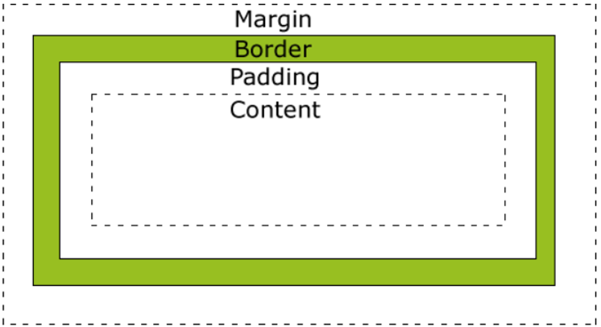
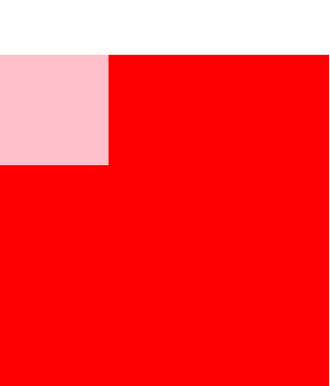

## 盒子模型组成
所有HTML元素可以看作盒子，在CSS中，"box model"这一术语是用来设计和布局时使用。CSS盒模型本质上是一个盒子，封装周围的HTML元素，它包括：边距，边框，填充，和实际内容。  
下面的图片说明了盒子模型(Box Model)：

不同部分的说明：
- Margin(外边距) - 清除边框外的区域，外边距是透明的。
- Border(边框) - 围绕在内边距和内容外的边框。
- Padding(内边距) - 清除内容周围的区域，内边距是透明的。
- Content(内容) - 盒子的内容，显示文本和图像。

## 盒子大小
默认情况下，当指定一个CSS元素的宽度和高度属性时，你只是设置内容区域的宽度和高度。要知道，完全大小的元素，你还必须添加填充，边框和边距。  
下面的例子中的元素的总宽度为300px：
```
div {
  width: 300px;
  border: 25px solid green;
  padding: 25px;
  margin: 25px;
}
```
盒子的实际宽度为：300px (宽) + 50px (左 + 右填充) + 50px (左 + 右边框) + 50px (左 + 右边距) = 450px

如果我们想让CSS元素的宽度和高度表示边距区域的大小，可以设置box-sizing属性：
- content-box	默认，这是CSS2.1指定的宽度和高度的行为。指定元素的宽度和高度（最小/最大属性）适用于box的宽度和高度。元素的填充和边框布局和绘制指定宽度和高度除外；
- border-box	指定宽度和高度（最小/最大属性）确定元素边框box。也就是说，对元素指定宽度和高度包括padding和border的指定。内容的宽度和高度减去各自双方该边框和填充的宽度从指定的"宽度"和"高度"属性计算；
- inherit	指定box-sizing属性的值，应该从父元素继承；
```
div {
  box-sizing: border-box;
  -moz-box-sizing: border-box; /* Firefox */
  width: 500px;
}
```

## 外边距
margin(外边距)属性定义元素周围的空间。
- auto	浏览器计算外边距。
- length	规定以具体单位计的外边距值，比如像素、厘米等。默认值是 0px。
- %	规定基于父元素的宽度的百分比的外边距。
- inherit	规定应该从父元素继承外边距。

该属性可以有1到4个值。分别表示上右下左，上（右左）下，（上下）（右左），四边；
```
p {
  margin: 2cm 4cm 3cm 4cm;
}
```
margin可以使用负值，重叠的内容。

在CSS中，外边距还可以分别设置：
```
p {
  margin-top: 2cm;
  margin-right: 2cm;
  margin-bottom: 2cm;
  margin-left: 2cm;
}
```

## 垂直外边框合并
垂直方向，两个margin遇到一起，margin值会合并，小值合并到大值里面去，水平方向margin值不会合并；
```
<head>
    <meta charset="UTF-8">
    <title>Document</title>
    <style type="text/css">
        .box1 {
            width: 200px;
            height: 200px;
            background-color: red;
            margin-bottom: 100px;
        }

        .box2 {
            width: 200px;
            height: 200px;
            background-color: red;
            margin-top: 50px;
        }
    </style>
</head>

<body>
    <div class="box1"></div>
    <div class="box2"></div>
</body>
```


理论上应该两个div间距为150px，但是实际上只有100px；

## 垂直外边距塌陷
```
<head>
    <meta charset="UTF-8">
    <title>Document</title>
    <style type="text/css">
        .box1 {
            width: 300px;
            height: 300px;
            background-color: red;
        }

        .box2 {
            width: 100px;
            height: 100px;
            background-color: pink;
            margin-top: 50px;
        }
    </style>
</head>

<body>
    <div class="box1">
        <div class="box2"></div>
    </div>
</body>
```
上面原本的意思是想子元素与父元素上边距为50px，但是运行结果却是box1上外边距为50px：  
  

父元素随着子元素塌陷下来了，这时我们的解决办法有两个：给父元素设置边框，或者给父元素设置overflow:hidden
```
<head>
    <meta charset="UTF-8">
    <title>Document</title>
    <style type="text/css">
        .box1 {
            width: 300px;
            height: 300px;
            background-color: red;
            /*border:1px solid;*/
            overflow: hidden;
        }

        .box2 {
            width: 100px;
            height: 100px;
            background-color: pink;
            margin-top: 50px;
        }
    </style>
</head>

<body>
    <div class="box1">
        <div class="box2"></div>
    </div>
</body>
```
注意，水平方向没有这个问题；

## 内边距
padding（填充）定义元素边框与元素内容之间的空间；
- length	规定以具体单位计的填充值，比如像素、厘米等。默认值是 0px
- %	规定基于父元素的宽度的百分比的填充
- inherit	指定应该从父元素继承padding
该属性可以有1到4个值。分别表示上右下左，上（右左）下，（上下）（右左），四边；
```
p {
  padding: 2cm 4cm 3cm 4cm;
}
```
注意：负值是不允许的。

在CSS 中，内边距是可以分别设置的：
```
p {
  padding-top: 25px;
  padding-bottom: 25px;
  padding-right: 50px;
  padding-left: 50px;
}
```

## 默认边距
有很多标签是有默认边距的，在实际应用中通常需要取消标签默认边距：
```
body,p,h1,h2,h3,h4,h5,h6,ul,li,ol,dl,dt,dd,input{
	margin:0;
	padding:0;
}
```

## 盒子阴影
box-shadow属性可以设置一个或多个阴影框。
- h-shadow	必需的。水平阴影的位置。允许负值
- v-shadow	必需的。垂直阴影的位置。允许负值
- blur	可选。模糊距离
- spread	可选。阴影的大小
- color	可选。阴影的颜色。在CSS颜色值寻找颜色值的完整列表
- inset	可选。从外层的阴影（开始时）改变阴影内侧阴影
设置语法为：box-shadow: h-shadow v-shadow blur spread color inset
```
div
{
    box-shadow: 10px 10px 5px #888888;
}
```
可以设置多个阴影，用逗号分隔；


## 水平对齐
1、利用margin属性水平居中  
要水平居中对齐一个元素(如 `<div>`), 可以使用 margin: auto;设置到元素的宽度将防止它溢出到容器的边缘。元素通过指定宽度，并将两边的空外边距平均分配：
```
<head>
    <meta charset="UTF-8">
    <title></title>
    <style type="text/css">
        .outer {
            width: 300px;
            height: 50px;
            background-color: green;
        }

        .center {
            margin: auto;
            width: 50%;
            border: 3px solid red;
            padding: 10px;
        }
    </style>
</head>

<body>
    <div class="outer">
        <div class="center"></div>
    </div>
</body>
```


注意，这种方式的水平对齐，只有应用于标准流中的元素；


2、利用margin水平右对齐
```
<head>
    <meta charset="UTF-8">
    <title></title>
    <style type="text/css">
        .outer {
            width: 300px;
            height: 50px;
            background-color: green;
        }

        .center {
            margin: 0 0 auto auto;
            width: 50%;
            border: 3px solid red;
            padding: 10px;
        }
    </style>
</head>

<body>
    <div class="outer">
        <div class="center"></div>
    </div>
</body>
```
