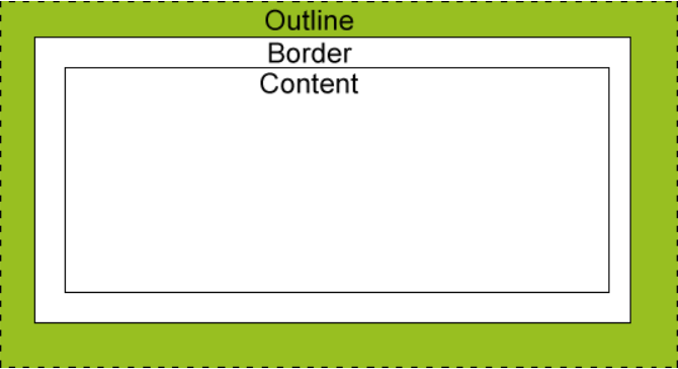

## 轮廓简介
轮廓（outline）是绘制于元素周围的一条线，位于边框边缘的外围，可起到突出元素的作用。  
轮廓（outline）属性指定元素轮廓的样式、颜色和宽度。


说明：
- outline是不占空间的，既不会增加额外的width或者height（这样不会导致浏览器渲染时出现reflow或是repaint）
- outline有可能是非矩形的（火狐浏览器下）

## 轮廓样式
outline-style属性指定outline的样式。
- none	    默认。定义无轮廓。
- dotted	定义点状的轮廓。
- dashed	定义虚线轮廓。
- solid	    定义实线轮廓。
- double	定义双线轮廓。双线的宽度等同于 outline-width 的值。
- groove	定义 3D 凹槽轮廓。此效果取决于 outline-color 值。
- ridge	    定义 3D 凸槽轮廓。此效果取决于 outline-color 值。
- inset	    定义 3D 凹边轮廓。此效果取决于 outline-color 值。
- outset	定义 3D 凸边轮廓。此效果取决于 outline-color 值。
- inherit	规定应该从父元素继承轮廓样式的设置。
```
p {
  outline-style: dotted;
}
```

##  轮廓宽度
outline-width指定轮廓的宽度。
- thin	规定细轮廓。
- medium	默认。规定中等的轮廓。
- thick	规定粗的轮廓。
- length	允许您规定轮廓粗细的值。
- inherit	规定应该从父元素继承轮廓宽度的设置
```
p {
  outline-style: dotted;
  outline-width: 5px;
}
```
注意： 请始终在outline-width属性之前声明outline-style属性。元素只有获得轮廓以后才能改变其轮廓的宽度。

## 轮廓颜色
outline-color属性指定轮廓颜色。
- color	    指定轮廓颜色。在 CSS颜色值寻找颜色值的完整列表。
- invert	默认。执行颜色反转（逆向的颜色）。可使轮廓在不同的背景颜色中都是可见。
- inherit	规定应该从父元素继承轮廓颜色的设置。
```
p {
  outline-style: dotted;
  outline-color: #00ff00;
}
```

## 轮廓属性简写
outline简写属性在一个声明中设置所有的轮廓属性。可以设置的属性分别是（按顺序）：outline-color, outline-style(requested), outline-width；
```
p {
  outline: #00FF00 dotted thick;
}
```

