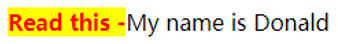

CSS伪元素是用来添加一些选择器的特殊效果。

伪类选择元素基于的是当前元素处于的状态，或者说元素当前所具有的特性，而不是元素的id、class、属性等静态的标志。由于状态是动态变化的，所以一个元素达到一个特定状态时，它可能得到一个伪类的样式；当状态改变时，它又会失去这个样式。由此可以看出，它的功能和class有些类似，但它是基于文档之外的抽象，所以叫伪类。

与伪类针对特殊状态的元素不同的是，**伪元素是对元素中的特定内容进行操作**，它所操作的层次比伪类更深了一层，也因此它的动态性比伪类要低得多。实际上，设计伪元素的目的就是去选取诸如元素内容第一个字（母）、第一行，选取某些内容前面或后面这种普通的选择器无法完成的工作。它控制的内容实际上和元素是相同的，但是它本身只是基于元素的抽象，并不存在于文档中，所以叫伪元素。

## 伪元素:before
:before 用来向元素中的开头插入内容，并指定插入内容的样式。使用content 属性来为指定插入的内容文本、图片等。
```
p:before
{ 
content:"Read this -";
background-color:yellow;
color:red;
font-weight:bold;
} 
<p>My name is Donald</p>
```


## 伪元素:after
:after 用来向元素中的末尾插入内容，并指定插入内容的样式。使用content 属性来为指定插入内容（文本、图片等）。
```
p:after
{ 
content:"- Remember this";
background-color:yellow;
color:red;
font-weight:bold;
}
```
## 伪元素:first-line
:first-line选择器匹配元素的第一行，可以为第一行内容使用以下属性： 
- font properties
- color properties 
- background properties
- word-spacing
- letter-spacing
- text-decoration
- vertical-align
- text-transform
- line-height
- clear

注意: "first-line" 选择器适用于块级元素中。
```
p:first-line
{ 
background-color:yellow;
}
```

## 伪元素:first-letter
:first-letter选择器匹配元素中第一个字母、数字、中文等，元素中子元素的letter也算；  
:first-letter选择器可以使用以下属性： 
- font properties
- color properties 
- background properties
- margin properties
- padding properties
- border properties
- text-decoration
- vertical-align (only if float is 'none')
- text-transform
- line-height
- float
- clear

注意: "first-letter" 选择器仅适用于在块级元素中.
```
p:first-letter
{
	font-size:200%;
	color:#8A2BE2;
}
<p><span>123</span>My name is Donald.</p>
```

## 伪元素::selection
:: selection匹配元素被选中的区域；
```
div::selection {
  background-color: red;
}
```
可以改变选区的颜色；

