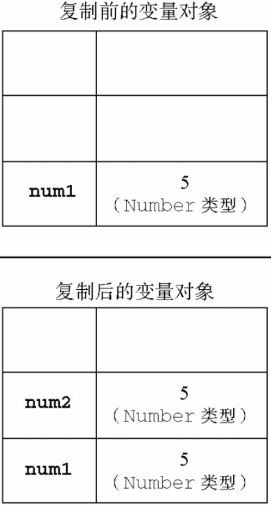

ECMAScript变量可能包含两种不同数据类型的值：基本类型值和引用类型值。基本类型值指的是简单的数据段，而引用类型值指那些可能由多个值构成的对象。

在将一个值赋给变量时，解析器必须确定这个值是基本类型值还是引用类型值。第3章讨论了5种基本数据类型：Undefined、Null、Boolean、Number和String。这5种基本数据类型是按值访问的，因为可以操作保存在变量中的实际的值。

引用类型的值是保存在内存中的对象。与其他语言不同，JavaScript不允许直接访问内存中的位置，也就是说不能直接操作对象的内存空间。在操作对象时，实际上是在操作对象的引用而不是实际的对象。为此，引用类型的值是按引用访问的。

在很多语言中，字符串以对象的形式来表示，因此被认为是引用类型的。ECMAScript放弃了这一传统。

## 动态属性
定义基本类型值和引用类型值的方式是类似的：创建一个变量并为该变量赋值。但是，当这个值保存到变量中以后，对不同类型值可以执行的操作则大相径庭。对于引用类型的值，我们可以为其添加属性和方法，也可以改变和删除其属性和方法。请看下面的例子：
```
var person = new Object();
person.name = 'Nicholas';
alert(person.name);       //'Nicholas'
```
以上代码创建了一个对象并将其保存在了变量person中。然后，我们为该对象添加了一个名为name的属性，并将字符串值'Nicholas'赋给了这个属性。紧接着，又通过alert()函数访问了这个新属性。如果对象不被销毁或者这个属性不被删除，则这个属性将一直存在。

但是，我们不能给基本类型的值添加属性，尽管这样做不会导致任何错误。比如：
```
var name = 'Nicholas';
name.age = 27;
alert(name.age);      //undefined
```
在这个例子中，我们为字符串name定义了一个名为age的属性，并为该属性赋值27。但在下一行访问这个属性时，发现该属性不见了。这说明只能给引用类型值动态地添加属性，以便将来使用。

## 复制变量
除了保存的方式不同之外，在从一个变量向另一个变量复制基本类型值和引用类型值时，也存在不同。如果从一个变量向另一个变量复制基本类型的值，会在变量对象上创建一个新值，然后把该值复制到为新变量分配的位置上。来看一个例子：
```
var num1 = 5;
var num2 = num1;
```
在此，num1中保存的值是5。当使用num1的值来初始化num2时，num2中也保存了值5。但num2中的5与num1中的5是完全独立的，该值只是num1中5的一个副本。此后，这两个变量可以参与任何操作而不会相互影响。下图形象地展示了复制基本类型值的过程。


当从一个变量向另一个变量复制引用类型的值时，同样也会将存储在变量对象中的值复制一份放到为新变量分配的空间中。不同的是，这个值的副本实际上是一个指针，而这个指针指向存储在堆中的一个对象。复制操作结束后，两个变量实际上将引用同一个对象。因此，改变其中一个变量，就会影响另一个变量，如下面的例子所示：
```
var obj1 = new Object();
var obj2 = obj1;
obj1.name = 'Nicholas';
alert(obj2.name);  //'Nicholas'
```
首先，变量obj1保存了一个对象的新实例。然后，这个值被复制到了obj2中；换句话说，obj1和obj2都指向同一个对象。这样，当为obj1添加name属性后，可以通过obj2来访问这个属性，因为这两个变量引用的都是同一个对象。下图展示了保存在变量对象中的变量和保存在堆中的对象之间的这种关系。


## 传递参数
ECMAScript中所有函数的参数都是按值传递的。也就是说，把函数外部的值复制给函数内部的参数，就和把值从一个变量复制到另一个变量一样。基本类型值的传递如同基本类型变量的复制一样，而引用类型值的传递，则如同引用类型变量的复制一样。

在向参数传递基本类型的值时，被传递的值会被复制给一个局部变量（即命名参数，或者用ECMAScript的概念来说，就是arguments对象中的一个元素）。在向参数传递引用类型的值时，会把这个值在内存中的地址复制给一个局部变量，因此这个局部变量的变化会反映在函数的外部。请看下面这个例子：
```
function setName(obj) {
    obj.name = 'Nicholas';
}

var person = new Object();
setName(person);
alert(person.name);    //'Nicholas'
```
以上代码中创建一个对象，并将其保存在了变量person中。然后，这个对象被传递到setName()函数中之后就被复制给了obj。在这个函数内部，obj和person引用的是同一个对象。换句话说，即使这个对象是按值传递的，obj也会按引用来访问同一个对象。于是，当在函数内部为obj添加name属性后，函数外部的person也将有所反映；
```
function setName(obj) {
    obj.name = 'Nicholas';
    obj = new Object();
    obj.name = 'Greg';
}

var person = new Object();
setName(person);
alert(person.name);    //'Nicholas'
```
这个例子与前一个例子的唯一区别，就是在setName()函数中添加了两行代码：一行代码为obj重新定义了一个对象，另一行代码为该对象定义了一个带有不同值的name属性。在把person传递给setName()后，其name属性被设置为'Nicholas'。然后，又将一个新对象赋给变量obj，同时将其name属性设置为'Greg'，此时obj指向的不是原来的person，而是一个新的对象，所以第二次修改name值对person是无影响的。

## 检测类型
要检测一个变量是不是基本数据类型？在前面介绍的typeof操作符是最佳的工具。说得更具体一点，typeof操作符是确定一个变量是字符串、数值、布尔值，还是undefined的最佳工具。如果变量的值是一个对象或null，则typeof操作符会像下面例子中所示的那样返回'object'：
```
var s = 'Nicholas';
var b = true;
var i = 22;
var u;
var n = null;
var o = new Object();

alert(typeof s);   //string
alert(typeof i);   //number
alert(typeof b);   //boolean
alert(typeof u);   //undefined
alert(typeof n);   //object
alert(typeof o);   //object
```
虽然在检测基本数据类型时typeof是非常得力的助手，但在检测引用类型的值时，这个操作符的用处不大。通常，我们并不是想知道某个值是对象，而是想知道它是什么类型的对象。为此，ECMAScript提供了instanceof操作符，其语法如下所示：
```
result = variable instanceof constructor
```
如果变量是给定引用类型（根据它的原型链来识别）的实例，那么instanceof操作符就会返回true。请看下面的例子：
```
alert(person instanceof Object);     // 变量person是Object吗？
alert(colors instanceof Array);      // 变量colors是Array吗？
alert(pattern instanceof RegExp);    // 变量pattern是RegExp吗？
```
根据规定，所有引用类型的值都是Object的实例。因此，在检测一个引用类型值和Object构造函数时，instanceof操作符始终会返回true。当然，如果使用instanceof操作符检测基本类型的值，则该操作符始终会返回false，因为基本类型不是对象。

null值使用typeof判定类型时，是object类型，但是使用instanceof判断时，却不是Object的实例，所以null不是引用数据类型：
```
alert(typeof null); //'object'
alert(null instanceof Object); //false
```

另外，函数通过instanceof判断时，是Object的实现，所以函数也是对象：
```
function test(){}
alert(test instanceof Object); //true
```