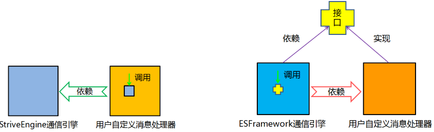
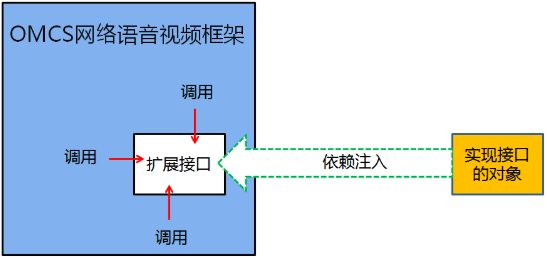

## 内聚
内聚，通俗的来讲，就是自己的东西自己保管，自己的事情自己做。

《周易·彖传》中讲“乾道变化，各正性命，保合太和，乃利贞”，就是要求每一个个体因循着各自的禀赋而努力成就各自的品性，然后各自保全，彼此和合，最终达成宇宙的完满状态。《论语·宪问》中，子路问君子。子曰：“修己以敬。”曰：“如斯而已乎？”曰：“修己以安人”，更是明确的教导我们要不断提高自身的内聚性，最大限度地减少给他人造成的麻烦，从而达到安人、安百姓、安天下的目标。我想，成长的过程就是一个不断提升内聚的过程。“自己的东西自己保管，自己的事情自己做”，这些孩提时代的教诲，放到今天仍能让不少“大人”脸红不已。太多的人保管不好自己的“东西”，保管不好自己的身体，保管不好自己的婚姻，更保管不好自己如蛛丝般震颤飘荡的狂乱的心。至于做好自己的事情，则更是惘然，甚至很多人连自己的事情是什么都搞不清楚，因此浑浑噩噩，饱食终日。内聚，是一个值得我们好好反思的问题。 

在面向对象的程序中，对象就是保管好自己的东西，做好自己的事情的程序模块——这就是内聚！当然，对象的内聚只是内聚的一个层次，在不同的尺度下其实都有内聚的要求，比如方法也要讲内聚，架构也要讲内聚。

## 依赖·耦合
在面向对象编程中，对象自身是内聚的，是保管好自己的数据，完成好自己的操作的，而对外界呈现出自己的状态和行为。但是，没有绝对的自力更生，对外开放也是必要的！一个对象，往往需要跟其他对象打交道，既包括获知其他对象的状态，也包括仰赖其他对象的行为，而一旦这样的事情发生时，我们便称该对象依赖于另一对象。只要两个对象之间存在一方依赖一方的关系，那么我们就称这两个对象之间存在耦合。 比如妈妈和baby，妈妈要随时关注baby的睡、醒、困、哭、尿等等状态，baby则要仰赖妈妈的喂奶、哄睡、换纸尿裤等行为，从程序的意义上说，二者互相依赖，因此也存在耦合。

## 耦合度·解耦和
耦合的程度就是耦合度，也就是双方依赖的程度。上文所说的妈妈和baby就是强耦合。而你跟快递小哥之间则是弱耦合。一般来说耦合度过高并不是一件好事。就拿作为IT精英的你来说吧，上级随时敦促你的工作进度，新手频繁地需要你指导问题，隔三差五还需要参加酒局饭局，然后还要天天看领导的脸色、关注老婆的心情，然后你还要关注代码中的bug 、bug、bug，和需求的变化、变化、变化，都够焦头烂额了，还猝不及防的要关注眼睛、颈椎、前列腺和头发的状态，然后你再炒个股，这些加起来大概就是个强耦合了。从某种意义上来说，耦合天生就与自由为敌，无论是其他对象依赖于你，还是你依赖其他对象。比如有人嗜烟、酗酒，你有多依赖它们就有多不自由；比如有人家里生了七八个娃，还有年迈的父母、岳父母，他们有多依赖你，你就有多不自由。所以老子这样讲：“五音令人耳聋，五色令人目盲，驰骋狩猎令人心发狂，难得之货令人行妨。”卢梭也是不无悲凉的说“人生而自由，却又无往而不在枷锁中”。因此，要想自由，就必须要降低耦合，而这个过程就叫做解耦和。

## 依赖倒置（Dependence Inversion Principle）
解耦和最重要的原则就是依赖倒置原则：
**高层模块不应该依赖底层模块，他们都应该依赖抽象。抽象不应该依赖于细节，细节应该依赖于抽象。**

在通信中，消息的收发和消息的处理往往密不可分。就一般的通信框架而言，消息的收发通常是已经实现了的，而消息的处理则是需要用户来自定义完成的。先看一个正向依赖的例子：轻量级通信引擎StriveEngine。tcpServerEngine是StriveEngine.dll提供通信引擎，它发布有一个MessageReceived事件。假设我定义了一个CustomizeHandler类来用于消息处理，那么CustomizeHandler的内部需要预定tcpServerEngine的MessageReceived事件，因此customizeHandler依赖于tcpServerEngine，这就是一个普通的依赖关系，也就是高层模块依赖于低层模块。  

而ESFramework通信框架则应用了依赖倒转原则。ESFramework定义了一个IcustomizeHandler接口，用户在进行消息处理时，实现该接口，然后将其注入到rapidPassiveEngine客户端通信引擎之中。   
很明显，相比于上一个例子，这里的依赖关系变成了rapidPassiveEngine依赖于customizeHandler，也就是说依赖关系倒置了过来，上层模块不再依赖于底层模块，而是它们共同依赖于抽象。rapidPassiveEngine依赖的是IcustomizeHandler接口类型的参数，customizeHandler同样是以实现的接口的方式依赖于IcustomizeHandler——这就是一个依赖倒置的典范。 

## 控制反转（Inversion of Control）
控制反转跟依赖倒置是如出一辙的两个概念，当存在依赖倒置的时候往往也存在着控制反转。但是控制反转也有自己的独特内涵。

首先我们要区分两个角色，server 跟 Client，也就是服务方和客户方。提供服务端的一方称为服务方，请求服务的一方称为客户方。我们最熟悉的例子就是分布式应用的C/S架构，服务端和客户端。其实除此之外，C/S关系处处可见。比如在TCP/IP协议栈中，我们知道，每层协议为上一层提供服务，那么这里就是一个C/S关系。当我们使用开发框架时，开发框架就是作为服务方，而我们自己编写的业务应用就是客户方。当Client调用server时，这个叫做一般的控制；而当server调用Client时，就是我们所说的控制反转，同时我们也将这个调用称为“回调”。控制反转跟依赖倒置都是一种编程思想，依赖倒置着眼于调用的形式，而控制反转则着眼于程序流程的控制权。一般来说，程序的控制权属于Client，而一旦控制权交到server，就叫控制反转。比如你去下馆子，你是Client餐馆是server。你点菜，餐馆负责做菜，程序流程的控制权属于Client；而如果你去自助餐厅，程序流程的控制权就转到server了，也就是控制反转。

控制反转的思想体现在诸多领域。比如事件的发布/ 订阅就是一种控制反转，GOF设计模式中也多处体现了控制反转，比如典型的模板方法模式等。而开发框架则是控制反转思想应用的集中体现。  
由此我们也可以总结出开发框架与类库的区别：使用开发框架时，框架掌握程序流程的控制权，而使用类库时，则是应用程序掌握程序流程的控制权。或者说，使用框架时，程序的主循环位于框架中，而使用类库时，程序的主循环位于应用程序之中。框架会回调应用程序，而类库则不会回调应用程序。

## 依赖注入(Dependency Injection)
依赖注入与依赖倒置、控制反转的关系仍旧是一本万殊。依赖注入，就其广义而言，即是通过“注入”的方式，来获得依赖。我们知道，A对象依赖于B对象，等价于A对象内部存在对B对象的“调用”，而前提是A对象内部拿到了B对象的引用。B对象的引用的来源无非有以下几种：A对象内部创建（无论是作为字段还是作为临时变量）、构造器注入、属性注入、方法注入。后面三种方式统称为“依赖注入”，而第一种方式我也生造了一个名词，称为“依赖内生”，二者根本的差异即在于，我所依赖的对象的创建工作是否由我自己来完成。当然，这个是广义的依赖注入的概念，而我们一般不会这样来使用。我们通常使用的，是依赖注入的狭义的概念。不过，直接陈述其定义可能会过于诘屈聱牙，我们还是从具体的例子来看。   

比如OMCS网络语音视频框架，它实现了多媒体设备（麦克风、摄像头、桌面、电子白板）的采集、编码、网络传送、解码、播放（或显示）等相关的一整套流程，可以快速地开发出视频聊天系统、视频会议系统、远程医疗系统、远程教育系统、网络监控系统等等基于网络多媒体的应用系统。然而，OMCS直接支持的是通用的语音视频设备，而在某些系统中，需要使用网络摄像头或者特殊的视频采集卡作为视频源，或者其它的声音采集设备作为音频源，OMCS则提供了扩展接口——用户自己实现这个扩展的接口，然后以“依赖注入”的方式将对象实例注入到OMCS中，从而完成对音、视频设备的扩展。  
“依赖注入”常常用于扩展，尤其是在开发框架的设计中。从某种意义上来说，任何开发框架，天生都是不完整的应用程序。因此，一个优秀的开发框架，不仅要让开发者能够重用这些久经考验的的卓越的解决方案，也要让开发者能够向框架中插入自定义的业务逻辑，从而灵活自由地适应特定的业务场景的需要——也就是说要具备良好的可扩展性。比如上面提到的OMCS网络语音视频框架可应用于音、视频聊天系统、视频会议系统、远程医疗系统、远程教育系统、网络监控系统等等基于网络多媒体的应用系统；以及ESFramework通信框架能够应用于即时通讯系统，大型多人在线游戏、在线网页游戏、文件传送系统、数据采集系统、分布式OA系统等任何需要分布式通信的软件系统中——这种良好的扩展性都与“依赖注入”的使用密不可分！

## 面向接口编程
谈到最后，“面向接口编程”已经是呼之欲出。无论是依赖倒置、控制反转、还是依赖注入，都已经蕴含着“面向接口编程”的思想。面向接口，就意味着面向抽象。作为哲学范畴而言，规定性少称为抽象，规定性多称为具体。而接口，就是程序中的一种典型的“抽象”的形式。面向抽象，就意味着面向事物的本质规定性，摆脱感性杂多的牵绊，从而把握住“必然”——而这本身就意味着自由，因为自由就是对必然的认识。  
也许以上的这段论述太过“哲学”，但是“一本之理”与“万殊之理”本身就“体用不二”——总结来看，依赖倒置、控制反转、依赖注入都围绕着“解耦和”的问题，而同时自始至终又都是“面向接口编程”的方法——因此，“面向接口编程”天生就是“解耦和”的好办法。由此也印证了从“抽象”到“自由”的这一段范畴的辩证衍化。  
 “面向对象”与“面向接口”并非两种不同的方法学，“面向接口”其实是“面向对象”的内在要求，是其一部分内涵的集中表述。我们对于理想软件的期待常被概括为“高内聚，低耦合”，这也是整个现代软件开发方法学所追求的目标。面向对象方法学作为现代软件开发方法学的代表，本身就蕴含着“高内聚，低耦合”的思想精髓，从这个意义上来说，“面向对象”这个表述更加侧重于“高内聚”，“面向接口”的表述则更加侧重于“低耦合”——不过是同一事物的不同侧面罢了。 
 
